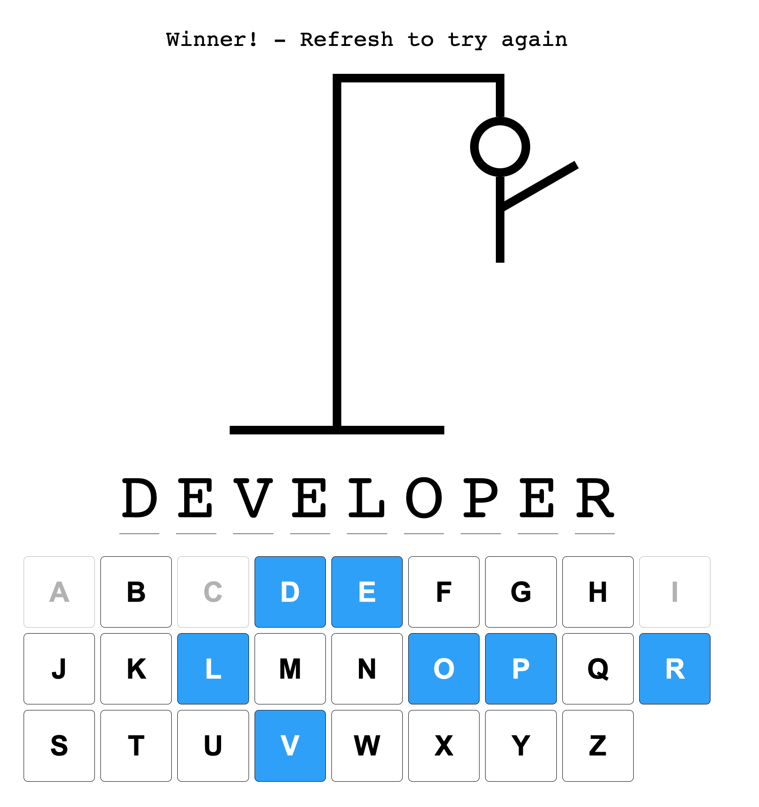

# Hangman Game - Readme

Welcome to the Hangman Game, a classic word-guessing game made with React and TypeScript!

## Introduction

Hangman is a simple yet entertaining game where the player tries to guess a secret word by suggesting letters within a limited number of attempts.

## Getting Started

To play the Hangman Game, follow these steps:

1. Make sure you have Node.js installed on your computer.
2. Download or clone the Hangman Game repository to your computer.
3. Using your preferred terminal, navigate to the project folder.
4. Install all the necessary dependencies by running the command `npm install`.
5. Start the development server with the command `npm run dev`.

The game will then be accessible locally at `http://localhost:5174/`.

## Technologies Used

The Hangman Game is built using the following technologies:

- React: The leading JavaScript library for creating flawless user interfaces.
- TypeScript: A superset of JavaScript that provides static typing for your code.

Join us in the world of Hangman and have fun guessing the secret word!
